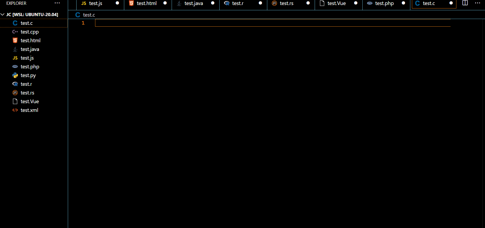
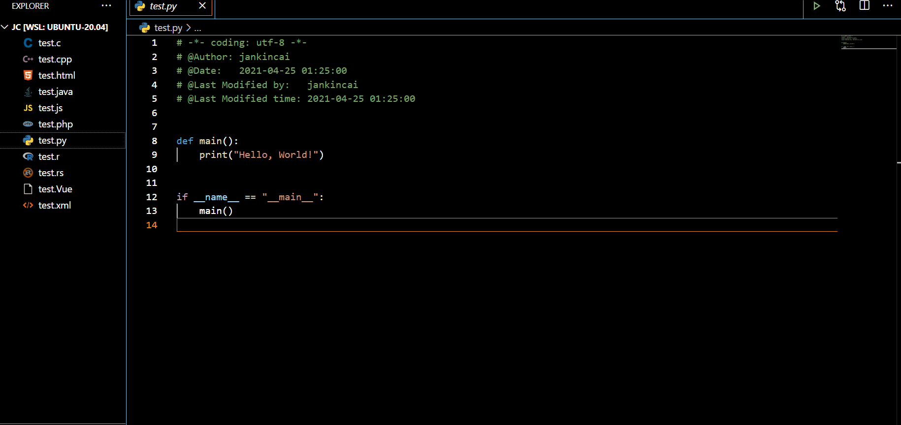

# VSCode FileHeader

[![Markeetplace Badge][marketplace-badge]][marketplace] [![Install][install-badge]][marketplace] [![Download][download-badge]][marketplace] ![Size][size-badge] [![BSD License Badge][license-badge]][license]

[中文文档](./README-zh_CN.md) | [英文文档](./README.md)

自动根据模板插入header、body内容插件，觉得不错的小伙伴们请点个赞👍~

* 使用 [cookiecutter-vscode](https://github.com/caizhengxin/cookiecutter-vscode)创建项目
* [自定义模板](https://github.com/caizhengxin/fileheader-template)
  * 详细模板定义，请参考[art-template](https://aui.github.io/art-template/docs/)

## 安装

```bash
1. ctrl + shift + x
2. Search VSCodeFileHeader
```

or

```bash
1. ctrl + p
2. ext install jankincai.vscodefileheader
```

## 功能

* 支持自动更新时间和作者
* 支持自定义模板(header/body)
* 支持内置多种语言模板
* 支持配置文件后缀名映射模板
* 支持过滤不需要插入header/body文件
* [支持vscode变量](https://code.visualstudio.com/docs/editor/variables-reference)
* 支持远程同步模板(需要安装git)

## 命令

通过`ctrl + shift + p`调出vscode命令行界面，然后输入`File Header`, 可以看到如下命令：

- `File Header: Add header comment`: 很少使用，如果`ctrl+s`被禁用, 才会使用该命令。
- `File Header: Crate template`: 必须设置自定义模板路径，才能创建新的模板。
- `File Header: Open template`: 必须处于某个文件下，才能打开对应的模板文件进行修改，通常情况下不建议直接修改默认模板文件。
- `File Header: Sync template`: 必须设置git远程地址，进行模板同步(git clone xxx)。

## 例子





[更多例子](./demo)

## Language

* ActionScript
* AppleScript
* ASP
* Batch
* C
* C#
* C++
* Clojire
* CSS
* D
* Dart
* Erlang
* Go
* Haskell
* HTML
* Java
* JavaScript
* LaTeX
* Lisp
* Lua
* Matlab
* Objective-C
* OCaml
* Pascal
* Perl
* PHP
* Python
* R
* Ruby
* Scala
* SCSS
* ShellScript
* SQL
* TypeScript
* Vue
* XML
* YAML

## 简单配置

```python
{
    "fileheader.author": "JanKinCai",
}
```

## 高级配置

```python
{
    # 设置用户名(作者)
    "fileheader.author": "Your name",

    # 设置是否插入body, 默认 false
    "fileheader.body": true,

    # 设置打开文件插入内容，默认 false
    "fileheader.open": true,

    # 设置保存文件是否插入内容，默认 true
    "fileheader.save": true,

    # 设置查找头部注释最大行号，默认 10
    "fileheader.header_max_line": 10,

    # 设置时间格式, 默认 YYYY-MM-DD HH:mm:ss
    # moment.js
    "fileheader.dateformat": "YYYY-MM-DD HH:mm:ss",

    # 设置后缀映射模板
    "fileheader.file_suffix_mapping": {
        ".pyx": "Python",
        "jkc-*.h": "H"
    },

    # 设置过滤不插入模板
    "fileheader.ignore": [
        "*.txt",             
        "test.py",           
        "test/"               
    ]
}
```

### 自定义模板示例(添加邮箱)

自定义模板Header ``template/header/Python.tmpl``:

```conf
# @Author: {{author}}
# @Date:   {{create_time}}
# @Email:  {{email}}
# @Last Modified by:   JanKinCai
# @Last Modified time: 2021-04-25 01:48:27
```

自定义模板Body ``template/body/Python.tmpl``:

```conf


def main():
    print("Hello, World!")


if __name__ == "__main__":
    main()
```

设置自定义模板:

```python
{
    # 模板路径(绝对路径)
    "fileheader.custom_template_path": "xxx/template/",
    "fileheader.other_config": {
        "email": "Your email",
    }
    # 设置后缀映射模板
    "fileheader.file_suffix_mapping": {
        ".py": "Python"
    },
}
```

* [详细自定义模板请参考](https://github.com/caizhengxin/fileheader-template)

### 高级自定义模板(完全实现自定义)

自定义模板header ``template/header/JKC.tmpl``:

```conf
# @Name: {{name}}
# @Time: {{last_modified_time}}
# @Last Modified Author: {{name}}
# @Last Modified Time: {{last_modified_time}}
```

自定义模板body ``template/body/JKC.tmpl``:

```conf
```

配置:

```python
{
    "fileheader.is_header_exists": "@Name:", # 用于识别头部，避免重复插入
    # 用于识别更新最后修改作者标志
    "fileheader.update_last_modified_time_flags": "@Last Modified Time:",
    # 用于识别更新最后修改时间标志
    "fileheader.update_last_modified_author_flags": "@Last Modified Author:",
    "fileheader.other_config": {
        "name": "jankincai",
    },
    "fileheader.file_suffix_mapping": {
        ".jkc": "JKC"
    },   
}
```

### vscode变量

https://code.visualstudio.com/docs/editor/variables-reference

自定义header ``template/header/Python.tmpl``:

```conf
# @Author: {{author}}
# @Date:   {{create_time}}
# @Last Modified by:   {{last_modified_by}}
# @Last Modified time: {{last_modified_time}}
# {{workspaceFolder}}
# {{workspaceFolderBasename}}
# {{file}}
# {{relativeFile}}
# {{relativeFileDirname}}
# {{fileBasename}}
# {{fileBasenameNoExtension}}
# {{fileDirname}}
# {{fileExtname}}
# {{cwd}}
```

### 远程同步配置模板(需要安装git)

```python
{
    "fileheader.custom_template_path": "xxx/template/",

    # 设置 SSH https://jdblischak.github.io/2014-09-18-chicago/novice/git/05-sshkeys.html
    # "fileheader.remote": "git@github.com:caizhengxin/fileheader-template.git"

    "fileheader.remote": "https://github.com/caizhengxin/fileheader-template.git"
}
```

## 开发者

```bash
$ git clone https://github.com/caizhengxin/vscodefileheader.git
$ code vscodefileheader
$ f5 # Enter Developer or Debug mode
```

## 发布安装包

```bash
# node_modules目录不能被.vscodeignore过滤.
$ sudo npm i vsce -g
$ vsce login jankincai
$ vsce package
$ vsce publish
```

[marketplace]: https://marketplace.visualstudio.com/items?itemName=jankincai.vscodefileheader#review-details
[marketplace-badge]: https://vsmarketplacebadge.apphb.com/version-short/jankincai.vscodefileheader.svg?style=flat-square
[install-badge]: https://img.shields.io/visual-studio-marketplace/i/jankincai.vscodefileheader?style=flat-square
[download-badge]: https://img.shields.io/visual-studio-marketplace/d/jankincai.vscodefileheader?style=flat-square
[size-badge]: https://img.shields.io/github/languages/code-size/caizhengxin/vscodefileheader?style=flat-square
[license]: ./LICENSE
[license-badge]: https://img.shields.io/github/license/caizhengxin/vscodefileheader?style=flat-square
