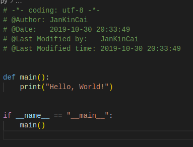
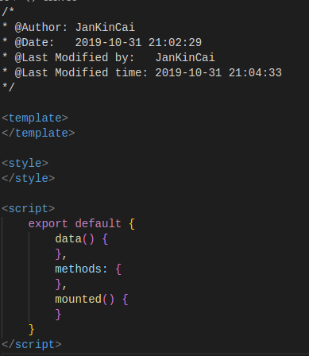
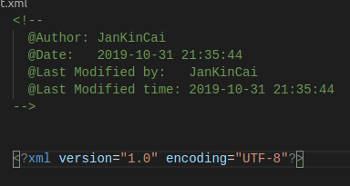

# VSCode FileHeader

 

This is a header extension that contains multiple languages.

## Install

```bash
ext install jankincai.vscodefileheader
```

## Features

* Support for automatic update time and author
* Support for custom template(header/body)
* Support for multiple languages
* Support for suffix name mapping templates
* Support for ignore sufixx

## Demo

Python:



Vue:



XML:



## Language

* ActionScript
* AppleScript
* ASP
* Batch
* C
* C#
* C++
* Clojire
* CSS
* D
* Diff
* Erlang
* Go
* Haskell
* HTML
* Java
* JavaScript
* LaTeX
* Lisp
* Lua
* Matlab
* Objective-C
* OCaml
* Pascal
* Perl
* PHP
* Python
* R
* Ruby
* Scala
* SCSS
* ShellScript
* SQL
* TypeScript
* Vue
* XML
* YAML

## Requirements

## Extension Settings

* Set author

```json
{
    "fileheader.author": "Your name"
}
```

* Set custom suffix name

```json
{
    "fileheader.file_suffix_mapping": {
        ".pyx": "Python"
    }
}
```

* Set insert body switch

```json
{
    "fileheader.body": true
}
```

* Set oepn file insert comment

```python
{
    "fileheader.open": true,
}
```

* Set save file insert comment, default ``true``

```python
{
    "fileheader.save": true,
}
```

* Set date foramt

```python
{
    "fileheader.dateformat": "YYYY-MM-DD HH:mm:ss"  # moment.js
}
```

* Set ignore

```python
{
    "fileheader.ignore": [
        "*.txt",
        "test.py",
        "test"
    ]
}
```

* Set custom template

```bash
# Create dir
mkdir template
cd template
mkdir header
mkdir body

# Add Header template
header/Python.tmpl

# -*- coding: utf-8 -*-
# @Author: {{author}}
# @Date:   {{create_time}}
# @Last Modified by:   {{last_modified_by}}
# @Last Modified time: {{last_modified_time}}


# Add Body template
body/Python.tmpl

print("Hello, World!")
```

Set template path

```json
{
    "fileheader.custom_template_path": "xxx/template/"
}
```

## Known Issues

## Release Notes
