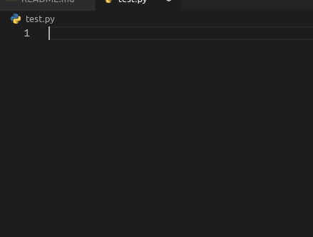
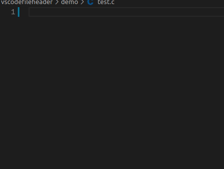
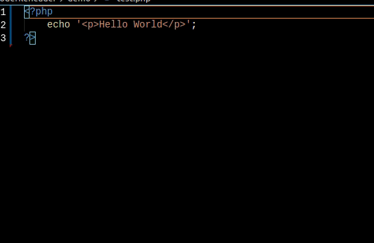
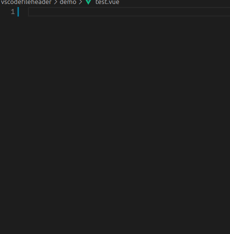
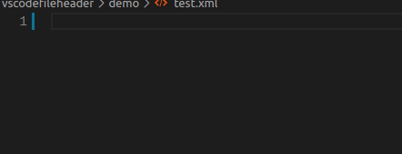

# VSCode FileHeader

[![Markeetplace Badge][marketplace-badge]][marketplace] [![Install][install-badge]][marketplace] [![Download][download-badge]][marketplace] ![Size][size-badge] [![BSD License Badge][license-badge]][license]

This is a header extension that contains multiple languages.

Feel good friends please give a star ~

* Usage [cookiecutter-vscode](https://github.com/caizhengxin/cookiecutter-vscode) create project.
* [Custom fileheader Extension template](https://github.com/caizhengxin/fileheader-template)

## Install

```bash
1. ctrl + shift + x
2. Search VSCodeFileHeader
```

or

```bash
1. ctrl + p
2. ext install jankincai.vscodefileheader
```

## Features

* Support for automatic update time and author
* Support for custom template(header/body)
* Support for multiple languages
* Support for suffix name mapping templates
* Support for ignore suffix
* Support for manual and automatic insert comment
* [Support vscode variables](https://code.visualstudio.com/docs/editor/variables-reference)

## Demo

Python:



C:



PHP:



Vue:



XML:



## Language

* ActionScript
* AppleScript
* ASP
* Batch
* C
* C#
* C++
* Clojire
* CSS
* D
* Erlang
* Go
* Haskell
* HTML
* Java
* JavaScript
* LaTeX
* Lisp
* Lua
* Matlab
* Objective-C
* OCaml
* Pascal
* Perl
* PHP
* Python
* R
* Ruby
* Scala
* SCSS
* ShellScript
* SQL
* TypeScript
* Vue
* XML
* YAML

## Usage

```python
# Settings
{
    "fileheader.author": "JanKinCai",
}

# Save file or ``ctrl + alt + i`` insert comment
```

## Requirements

## Extension Settings

### Set author

```json
{
    "fileheader.author": "Your name"
}
```

### Set custom suffix name

```json
{
    "fileheader.file_suffix_mapping": {
        ".pyx": "Python"
    }
}
```

### Set insert body switch

```json
{
    "fileheader.body": true
}
```

### Set open file insert comment

```python
{
    "fileheader.open": true,
}
```

### Set save file insert comment, default ``true``

```python
{
    "fileheader.save": true,
}

# Set false, Need to add comments manually
ctrl + alt + i
```

### Set date foramt

```python
{
    "fileheader.dateformat": "YYYY-MM-DD HH:mm:ss"  # moment.js
}
```

### Set ignore

```python
{
    "fileheader.ignore": [
        "*.txt",             # Ignore suffix name
        "test.py",           # Ignore file
        "test"               # Ignore dir
    ]
}
```

### Set custom template(Add Email)

Note: ``The template header connot be modified and can be added.``

Custom Header template ``template/header/Python.tmpl``:

```conf
# @Author: {{author}}
# @Date:   {{create_time}}
# @Email:  {{email}}
# @Last Modified by:   {{last_modified_by}}
# @Last Modified time: {{last_modified_time}}

```

Custom Body template ``template/body/Python.tmpl``:

```conf


def main():
    print("Hello, World!")


if __name__ == "__main__":
    main()
```

Settings:

```python
{
    # Set template path
    "fileheader.custom_template_path": "xxx/template/",
    # Set other config
    "fileheader.other_config": {
        "email": "Your email",
    }
    # Set suffix mapping
    "fileheader.file_suffix_mapping": {
        ".py": "Python"
    },
}
```

* [Custom fileheader Extension template](https://github.com/caizhengxin/fileheader-template)

### Set vscode variables

https://code.visualstudio.com/docs/editor/variables-reference

Custom Header template ``template/header/Python.tmpl``:

```conf
# @Author: {{author}}
# @Date:   {{create_time}}
# @Last Modified by:   {{last_modified_by}}
# @Last Modified time: {{last_modified_time}}
# {{workspaceFolder}}
# {{workspaceFolderBasename}}
# {{file}}
# {{relativeFile}}
# {{relativeFileDirname}}
# {{fileBasename}}
# {{fileBasenameNoExtension}}
# {{fileDirname}}
# {{fileExtname}}
# {{cwd}}
```

## Known Issues

## Release Notes

[marketplace]: https://marketplace.visualstudio.com/items?itemName=jankincai.vscodefileheader#review-details
[marketplace-badge]: https://vsmarketplacebadge.apphb.com/version-short/jankincai.vscodefileheader.svg?style=flat-square
[install-badge]: https://img.shields.io/visual-studio-marketplace/i/jankincai.vscodefileheader?style=flat-square
[download-badge]: https://img.shields.io/visual-studio-marketplace/d/jankincai.vscodefileheader?style=flat-square
[size-badge]: https://img.shields.io/github/languages/code-size/caizhengxin/vscodefileheader?style=flat-square
[license]: ./LICENSE
[license-badge]: https://img.shields.io/github/license/caizhengxin/vscodefileheader?style=flat-square
